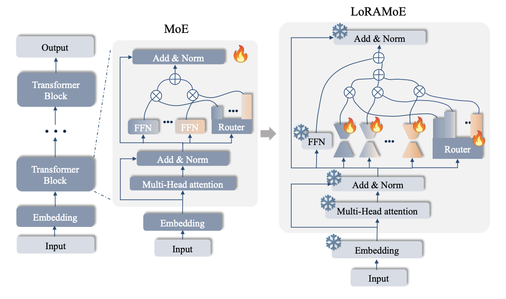

# LoRAMoE: Revolutionizing Mixture of Experts for Maintaining World Knowledge in Language Model Alignment


This is the repository for [LoRAMoE: Revolutionizing Mixture of Experts for Maintaining World Knowledge in Language Model Alignment](https://arxiv.org/abs/2312.09979).


## Implementation

You can quickly export the environment by using the follow command:
```bash
conda env create -f environment.yml
```
or
```bash
conda create -n loramoe python=3.10 -y

pip install -r requirements.txt
```

We *do not* install the `peft` to avoid the conflicts with the local `peft` package.

## Usage

### Data Format

We construct a tiny dataset to demonstrate the data format during the training and inference phase and evaluate the correct of code.

```
data/
|--tiny_data/
  |--train/train.json
  |--test.json
```


### Train LoRAMoE on Single Node
```bash
bash run_loramoe.sh
```

### Explanations of Hyper-parameters

*Readme.md is coming soon~ about one day*

## Note: Our main changes to `transformers` and `peft`

*Readme.md is coming soon~ about one day*

## Citation
If you find this useful in your research, please consider citing
```
@misc{dou2024loramoe,
      title={LoRAMoE: Revolutionizing Mixture of Experts for Maintaining World Knowledge in Language Model Alignment}, 
      author={Shihan Dou and Enyu Zhou and Yan Liu and Songyang Gao and Jun Zhao and Wei Shen and Yuhao Zhou and Zhiheng Xi and Xiao Wang and Xiaoran Fan and Shiliang Pu and Jiang Zhu and Rui Zheng and Tao Gui and Qi Zhang and Xuanjing Huang},
      year={2023},
      eprint={2312.09979},
      archivePrefix={arXiv},
      primaryClass={cs.CL}
}
```

